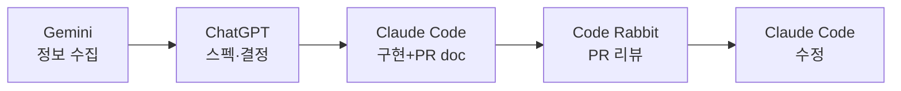
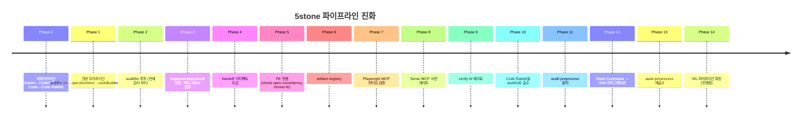
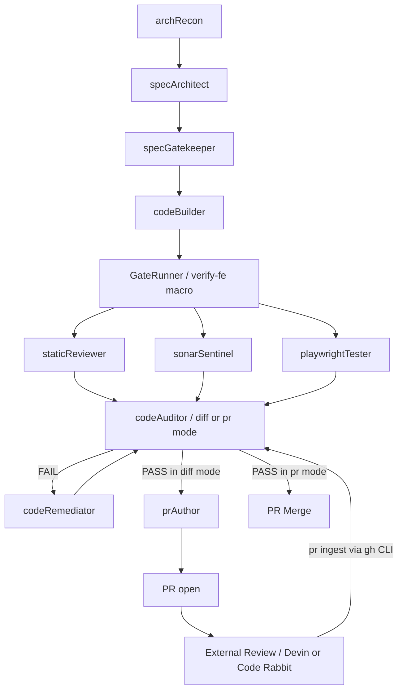
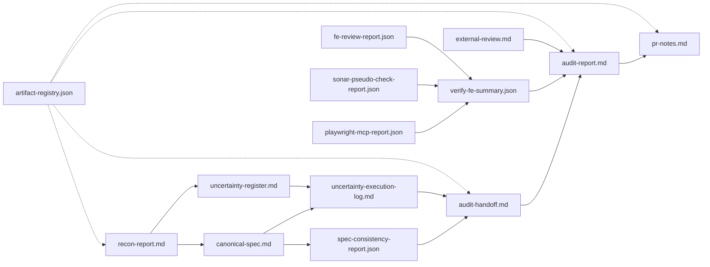

# 나의 AI 활용기 — 캡스톤 5조 / 하장한

> Date: 2026-05-02
> Project: 상담 로그 기반 CS 워크플로우 생성 시스템 (`ostone`)
> Author: 202126852 하장한

## 1. AI와 함께 프로젝트를 진행하는 전반적인 프로세스

### 1.1 주로 활용한 AI 도구

내가 한 학기 동안 손에 익힌 도구는 네 가지다. 각자가 어떤 자리에 있는지부터 적는다.

- **Gemini** — 기술 컨텍스트 1차 정보 수집과 단발 질의용. 사용량과 반응속도가 풍부해 "처음 들어보는 라이브러리"를 빠르게 훑을 때 가장 먼저 손이 간다.
- **ChatGPT** — 데이터 구조화, 감사, 의사결정 보조용. 학기 초에는 스펙·불확실성 결정의 주력이었고, 지금은 보조 자리로 내려왔다.
- **Claude Code** — 스펙 작성·구현·문서화·감사·수정의 파이프라인 본체. 내가 운용하는 파이프라인이 Claude Code 위에서 동작한다.
- **Code Rabbit → Devin** — PR 자동 리뷰. 학기 초에는 Code Rabbit이 그 자리에 있었고 한때 PR 병목의 원인이기도 했다. 그 결과를 audit 에이전트가 흡수하는 자리로 옮긴 뒤, 팀 차원에서 PR 리뷰 도구를 Devin으로 교체하는 중이다.

이 네 도구를 두는 위치는 학기 내내 바뀌었다. 학기 초의 흐름은 이렇게 단순했다.



이 다이어그램은 "도구가 직렬로 늘어선 수공업" 상태를 보여준다. 정보 수집 → 결정 → 구현 → 리뷰 → 수정이 사람 손을 거쳐 한 단계씩 넘어가는 구조다.

### 1.2 어떤 부분에 주로 AI를 활용했는가

- **기획**: 프로젝트 기획 단계에서 시장 조사, 기획서 윤문 작업, User Story 매핑, 초기 스키마 설계 등등 광범위한 범위의 작업에 적극적으로 활용했다. 당시에도 단순 자료 조사, 사실 확인에는 Gemini를, 실제 작문과 분석에는 Claude를 주로 사용하는 방식으로 원시적인 형태의 하네스를 썼던 기억이 있다. 당시에는 주로 GUI 버전의 AI를 사용해서 여러 컨텍스트를 파일로 생성하고, 주입하는 과정이 상당히 번거로웠던 기억이 있다.

- **스펙**: 학기 초에는 ChatGPT에 요구사항을 던지고 역질문을 받으며 스펙을 다듬었다. 지금은 파이프라인의 `archRecon → specArchitect` 두 에이전트가 같은 역할을 맡는다. 
- **클라우드**: 런타임은 Render, DB는 Neon을 쓴다. 배포 가이드는 [`.agent/docs/deployment.md`](https://github.com/ajou-2026-1-capstone-5/ostone/blob/main/.agent/docs/deployment.md)에 모아두고, 환경변수 매핑이나 배포 환경 설정에 AI 보조를 받았다. 주로 배포 실패 로그를 수동으로 주입하고, 에이전트가 잘못된 환경변수 설정을 짚어주는 방식으로 진행했다.
- **코딩 / 테스트**: Claude Code 본체 + Playwright MCP + SonarQube MCP. 실제 코딩과 테스트 코드 작성은 파이프라인 안에서 일어나고, 테스트 검증은 위 두 MCP가 런타임에서 맡는다. 파이프라인 내부의 검증은 근본적으로는 PR의 리뷰 병목을 최소화하기 위한 목적으로 수행된다. 이를 위해, SonarQube의 Quality Gate 검증(Test Coverage > 80%, 정적 분석 기준 버그 X)을 SonarQube MCP, 자체 Test Coverage 분석 툴(jacoco, pnpm test --coverage)으로 최대한 모방하고 있다. 다만 완전히 모사할 수는 없기에 여전히 개선 중이다.

### 1.3 팀 내 협업에서의 활용

팀이 공용으로 도입한 것은 "프롬프트"가 아니라 "문서"였다. 우리 팀은 공용 프롬프트 저장소를 따로 두지 않았고, 대신 [`AGENTS.md`](https://github.com/ajou-2026-1-capstone-5/ostone/blob/main/AGENTS.md), [`README.md`](https://github.com/ajou-2026-1-capstone-5/ostone/blob/main/README.md), [`frontend/DESIGN.md`](https://github.com/ajou-2026-1-capstone-5/ostone/blob/main/frontend/DESIGN.md), 그리고 [`.agent/`](https://github.com/ajou-2026-1-capstone-5/ostone/tree/main/.agent) 디렉토리(rules / docs / specs)로 작업 흐름을 통제했다. 어떤 프롬프트를 쓰느냐보다 어떤 컨벤션·아키텍처·디자인 기준을 따르느냐를 먼저 합의해두면, 그 위에서 누가 어떤 LLM을 쓰든 산출물이 어긋나지 않는다.

PR 리뷰 도구도 팀이 한 번 같이 정했다. 학기 초의 Code Rabbit을 거쳐 지금은 [Devin](https://devin.ai)으로 PR 코드 리뷰를 넘기는 과도기에 있다. 개발 방식은 SDD(Spec-Driven Development) — 백로그 1건마다 `spec/{canonical}` 브랜치에서 스펙 PR을 먼저 머지하고, 그 위에서 `feature/{canonical}-{설명}` 브랜치를 따 구현 PR을 올리는 두 단계 흐름이다. 두 PR 모두에서 코드 리뷰가 발생하기 때문에, 스펙의 품질이나 구현체의 스펙 드리프트 문제를 효과적으로 방어한다.

---

## 2. Agent / Skill / Harness 활용

### 2.1 왜 단일 챗에서 파이프라인으로 갔는가

1.1의 다이어그램이 보여준 비파이프라인 시기는 다섯 가지 한계가 있었다.

1. **휘발성** — 시크릿 세션 위주라 컨텍스트가 세션과 함께 사라졌다. 다음 날이면 처음부터 다시 설명해야 했다.
2. **세션 종속** — 한 세션에서 쌓은 결정이 다른 세션으로 넘어가지 않아 마이그레이션이 사실상 불가능했다.
3. **재현성 부족** — 문서화·통합이 어려워 같은 결과를 다시 만들 수 없었다.
4. **할루시네이션** — 한 챗에 너무 많은 책임이 몰리면 LLM이 사실과 추측을 섞기 시작했다.
5. **PR 병목** — Code Rabbit 리뷰가 누적될수록 PR 한 개를 닫는 데 걸리는 시간이 길어졌고, 선제적 리뷰 절차를 짤 여지도 없었다.

이 시기의 PR이 [PR #6](https://github.com/ajou-2026-1-capstone-5/ostone/pull/6)과 [PR #9](https://github.com/ajou-2026-1-capstone-5/ostone/pull/9)다. 두 PR 모두 SDD 도입 이전이라 한 PR 안에 스펙·구현이 동시에 들어 있었고, 그게 후반에 가서 추적을 어렵게 만들었다. 구현이 다른 백로그와는 달리 제대로 문서화되지 않아 의사소통에도 병목을 야기했다.

### 2.2 5stone 파이프라인의 진화 — 14 단계 타임라인



이 타임라인의 핵심은 단계가 늘어났다는 점이 아니라, 매 단계마다 **(동기 → 변경 → 잔여 문제)** 가 누적됐다는 점이다. 굵직한 단계만 풀어 쓴다.

- **Phase 1 — 경량 파이프라인**: ChatGPT가 사용자에게 역질문하며 프롬프트를 보강하던 패턴을 형식화했다. `recon → decision → implementation → documentation` 4단계로 나눠 BE 백로그 3.3.2를 처리했다 ([스펙 PR #14](https://github.com/ajou-2026-1-capstone-5/ostone/pull/14) → [구현 PR #15](https://github.com/ajou-2026-1-capstone-5/ostone/pull/15)).
- **Phase 2 — audit/fix 루프**: PR 리뷰 병목이 여전했고, 프로젝트 룰이 [PR #11](https://github.com/ajou-2026-1-capstone-5/ostone/pull/11)로 갱신되며 코드 감사·수정 루프 자체가 필요해졌다. [Issue #17](https://github.com/ajou-2026-1-capstone-5/ostone/issues/17)에서 critical 8건이 잡혔고, 이걸 [스펙 PR #18](https://github.com/ajou-2026-1-capstone-5/ostone/pull/18) → [구현 PR #19](https://github.com/ajou-2026-1-capstone-5/ostone/pull/19)로 정리했다.
- **Phase 3 — 분할과 fix 흡수**: implementation 에이전트의 컨텍스트가 한계였다. implementation 에이전트가 내부적으로 audit 에이전트까지 호출하고 자체적으로 수정까지 하고 있었기에 컨텍스트 부하가 극심해져 한번의 쿼리만으로도 컴팩션이 발생하는 수준의 극심한 부하가 발생했다. implementation 단계, audit 단계를 명시적으로 나누고, 백로그 구현 흐름에도 fix 에이전트를 합류시켰다. ([스펙 PR #23](https://github.com/ajou-2026-1-capstone-5/ostone/pull/23) → [구현 PR #24](https://github.com/ajou-2026-1-capstone-5/ostone/pull/24)).
- **Phase 4 — handoff 아티팩트**: implementation ↔ audit 사이 컨텍스트 상실이 잦아 `audit-handoff-{canonical}.md`와 `.auditignore`로 명시적인 인계 산출물을 만들었다.
- **Phase 5~7 — FE 보강과 런타임 검증**: FE 백로그를 본격적으로 시작하며 리뷰 폭증이 시작됐다. `check-spec-consistency`, `review-fe`를 추가하고 `artifact-registry-{canonical}.json`로 전 산출물 색인을 강제한 뒤, Playwright MCP 기반 `test-playwright`/`maintain-playwright`를 끼워 넣었다. FE 2.2.8 작업이 이 단계의 대표 사례다 ([스펙 PR #127](https://github.com/ajou-2026-1-capstone-5/ostone/pull/127) → [구현 PR #128](https://github.com/ajou-2026-1-capstone-5/ostone/pull/128)).
- **Phase 8~10 — Sonar 게이트, 매크로, Code Rabbit 흡수**: SonarQube가 CI 게이트로 추가되며 `sonar-pseudo-check`를 사전 게이트로 끼웠고, 정적 리뷰 + SonarQube + Playwright를 묶은 `verify-fe` 매크로를 만들었다. 이때까지는 Code Rabbit이 자체적으로 제공하는 수정 프롬프트를 바로 에이전트에 붙여넣는 식으로 작업했으나, 산출물과 실제 구현체 사이 괴리가 발생한다는 문제가 있어 audit이 검수하여 Accept/Reject를 결정하도록 흡수했다. 동시에 수정 작업 역시 fix 에이전트가 전담하도록 정비했다.
- **Phase 11~13 — preprocess 분리/재흡수, Skill 마이그레이션**: audit 에이전트의 책임이 비대해져 응답속도가 크게 느려졌고, 컨텍스트 부하 역시 위험한 수준이었다. 잠시 `audit-preprocess`를 분리했다가, 결국 헬퍼 스크립트 형태로 `codeAuditor` 안에 다시 합쳤다. 같은 시기에 슬래쉬 커맨드 체계를 Skill 체계로 옮기는 작업도 진행했다 — 1단계로 중복 부분을 `_shared-bootstrap.md`로 분리, 2단계로 본격 Skill 구조 (`SKILL.md` / `CONTRACT/` / `domain/` / `branch/` / `scripts/`) 도입. 위치는 `~/.claude/skills/5stone-*/`, 공통은 `~/.claude/skills/_shared/5stone/`. 이 단계의 풀스택 산출물 사례가 FE 2.3.2다 ([스펙 PR #163](https://github.com/ajou-2026-1-capstone-5/ostone/pull/163) → [구현 PR #167](https://github.com/ajou-2026-1-capstone-5/ostone/pull/167)).
- **Phase 14 — ML 파이프라인 확장 (진행중, 2026-05-02)**: `specGatekeeper`에 SC-M1~M8 ML 모드를 도입하고 archRecon/specArchitect/codeAuditor/codeBuilder에 ML 분기를 추가하는 작업이 지금 흐르고 있다.

각 Phase의 변경은 직전 Phase에서 남은 잔여 문제(컨텍스트 부하·산출물 누락·게이트 부재)를 막으려고 들인 것이다. 한 번에 설계한 게 아니라 매번 부족한 자리를 메운 결과가 14단계가 됐다.

### 2.3 현재 스킬 카탈로그와 표준 핸드오프 산출물

지금 운용 중인 스킬은 13종이다 (`~/.claude/skills/`):

```text
5stone-any-archRecon         5stone-any-specArchitect      5stone-any-codeBuilder
5stone-any-codeAuditor       5stone-any-codeRemediator     5stone-any-prAuthor
5stone-any-archMapper        5stone-cross-specGatekeeper   5stone-cross-sonarSentinel
5stone-fe-staticReviewer     5stone-fe-playwrightTester    5stone-fe-playwrightMaintainer
5stone-fe-GateRunner
```

명명 규칙은 `5stone-{scope}-{role}`. `any`는 BE/FE/ML 공통, `fe`는 프론트 전용, `cross`는 스코프 횡단 게이트.

각 스킬은 백로그 단위(canonical)로 산출물을 남긴다. 백로그 1건이 끝나면 다음 디렉토리가 채워져 있다.

```text
.handoff/{canonical}/
├── recon-report-{canonical}.md
├── uncertainty-register-{canonical}.md
├── uncertainty-execution-log-{canonical}.md
├── spec-consistency-report-{canonical}.json
├── audit-handoff-{canonical}.md
├── audit-input-{canonical}.json
├── audit-report-{canonical}-{YYYY-MM-DD-HHmm}.md
├── external-review-{canonical}.md
├── fe-review-report-{canonical}.json
├── playwright-mcp-report-{canonical}.json
├── sonar-pseudo-check-report-{canonical}.json
├── verify-fe-summary-{canonical}.json
├── artifact-registry-{canonical}.json
└── pr-notes-{canonical}.md
```

이 디렉토리가 이번 학기의 가장 큰 자산이라고 본다. 같은 백로그를 두 번 다른 사람이 봐도 같은 컨텍스트로 들어올 수 있게 됐다.

백로그 1건이 머지에 도달하기까지의 전체 흐름은 한 그래프로 그릴 수 있다. PR 전(`diff` 모드)과 PR 후(`--pr` ingest 모드)가 사실상 동일한 fix 루프를 두 번 통과하는 구조이기 때문이다.



이 다이어그램의 요점은 두 가지다. 첫째, codeAuditor↔codeRemediator로 구성된 fix 루프가 단 하나뿐이며, 그 루프가 **verify 결과**와 **외부 PR 리뷰**라는 두 가지 입력을 받아 **prAuthor**와 **Merge**라는 두 가지 출구로 분기한다. 즉 PR 전과 PR 후가 같은 메커니즘이다. 둘째, 외부 리뷰가 파이프라인 바깥에 떠다니지 않고 audit-report라는 동일한 보고서로 합류한다 — 외부 리뷰어와 내부 게이트가 같은 자리에서 우선순위를 다투게 만든 것이 Phase 10에서 들인 변경의 본질이다.

위 그림은 "누가 무엇을 하는가"의 흐름이고, 같은 라이프사이클을 산출물 관점에서 다시 그리면 아래와 같다. 각 단계가 이전 단계의 산출물을 입력으로 받고, 자기 산출물을 다음 단계에 넘긴다.



산출물 파이프라인의 핵심은 세 가지다. 첫째, `recon-report`에서 `canonical-spec`과 `uncertainty-register`가 분기되고, `spec-consistency-report`가 gate를 통과해야 `audit-handoff`가 만들어진다. 둘째, verify 3종(`fe-review-report`·`sonar-pseudo-check-report`·`playwright-mcp-report`)이 `verify-fe-summary`로 합쳐져 `audit-report`로 흘러가고, 사후의 `external-review`도 같은 `audit-report`로 합류한다 — 즉 audit-report가 모든 검증 결과의 단일 수렴점이다. 셋째, `artifact-registry`가 위 산출물 전체를 한 백로그 단위로 인덱싱해, 후행 스킬이나 사람이 어떤 단계의 산출물도 같은 진입점으로 찾아갈 수 있게 한다.

#### 예시: audit-report-232-2026-04-30-2006.md 발췌

``````markdown
### V-003 [Warning] DomainPackSummaryPage.tsx — 404 에러 시 재시도 버튼 무조건 렌더링

- Type: Rule Violation (KISS/일관성) + External Review
- Rule: principles.md § KISS: 불필요한 동작 금지. error-handling.md § 에러 상태 처리 일관성
- File: frontend/src/pages/domain-pack/ui/DomainPackSummaryPage.tsx:90-92
- Source: EC-023 (devin, 2차 리뷰)
- Description:
404 에러 시에도 "다시 시도" 버튼이 무조건 렌더링됨. 존재하지 않는 Pack에 대한 재시도는 의미 없으며 사용자를 오도함. SummaryDetailPanel.tsx에서는 이미 {!is404 && <button>다시 시도</button>} 패턴으로 처리함 — 코드베이스 내 일관성 위반.
      // 현재 — is404 무관하게 항상 렌더링
      <button type="button" className={styles.retryBtn} onClick={() => packQuery.refetch()}>
        다시 시도
      </button>
      // SummaryDetailPanel.tsx는: {!is404 && <button>다시 시도</button>}
- Expected: {!is404 && <button ...>다시 시도</button>} 조건부 렌더링 적용
- Actual: 무조건 렌더링
- Requires User Decision: No
- Fix Direction: <button> 렌더링을 {!is404 && (...)} 으로 감싸기.
- Fix Result: Fixed (auto) — 404 에러 시 {!is404 && <button>다시 시도</button>} 조건부 렌더링으로 변경. 기존 테스트 모두 통과. commit f45bbe7.
---
## Rejected External Findings
### REF-009 [False-Positive] EC-025 — sentinel -1 query key 위험

- Source: EC-025
- Reviewer: devin-ai-integration[bot]
- File/Line (claim): frontend/src/features/domain-pack-summary-read/model/useVersionDetail.ts:12
- Verdict: False-Positive
- Reason: versionId ?? -1 with enabled: versionId !== null 패턴은 TanStack Query의 표준적 sentinel key 패턴임. parseRouteId는 양수 정수만 허용하므로 -1은 유효한 버전 ID가 될 수 없음. 캐시 충돌 위험 없음.
``````


### 2.4 Harness — Claude Code 위에서의 운용 패턴

스킬 자체보다 더 중요한 건 그것을 굴리는 harness다. 내 경우엔 다음 세 가지로 구성된다.

- **Skill 체계** — 슬래쉬 커맨드를 그대로 쓰면 중복이 빠르게 쌓인다. 공통 부분은 `~/.claude/skills/_shared/5stone/bootstrap.md`로 빼서 모든 스킬이 같은 source에서 우선순위(`사용자 결정 > CLAUDE.md(AGENTS.md) > .agent/rules > .agent/docs > .agent/specs > frontend/DESIGN.md > skill 본문`)를 읽도록 강제했다. 이 한 줄이 정렬되니까 스킬 사이의 충돌이 사라졌다.
- **MCP 연동** — Playwright MCP는 FE 변경 후 실제 브라우저에서 라우트 렌더·콘솔 에러·네트워크 실패를 잡는다. SonarQube MCP는 CI Quality Gate가 깨지기 전에 동일 룰셋을 미리 돌린다. 둘 다 "사람이 PR을 올린 뒤에 알게 되는 것"을 "에이전트가 PR 전에 알게 되는 것"으로 옮긴 장치다.
- **Hook과 컨벤션** — pre-commit에서 husky + lint-staged로 BE/FE/ML 각각의 포맷·린트·타입 검사가 돌고, paths-filter로 변경 모듈만 CI를 태운다. 에이전트가 만든 코드도 이 게이트는 똑같이 통과해야 한다. 사람이 짠 코드와 같은 기준으로 보겠다는 의도다.

---

## 3. 기타 활용 방식·경험

본 흐름 바깥에서도 AI를 곳곳에 끼워 두고 썼다.

- **클라우드 배포 — "선임이 상시 대기"하는 활용** — Render·Neon 환경 구성에서 환경변수 설정에 도움을 받은 게 가장 기억에 남는다. 이 시점에 깨달은 게 있다. Claude Code는 단순한 코더가 아니라, 툴(MCP·hooks·게이트)을 충분히 갖춰 두면 선임 프로그래머가 옆자리에 상시 대기하는 것에 가까운 도구라는 것이다. 요즘은 문서 작성에도 같은 방식으로 쓰고 있는데, 결과물을 직접 붙여넣기 할 필요가 없다는 점이 특히 매력적이다.
- **SDD를 직접 해보고 배운 것** — 거시적으로는 waterfall 모델의 부활처럼 보이지만, 미시적으로(개별 백로그) 보면 agile 방법론이 그대로 살아 있다. AI가 발전하면서 두 방식의 장점을 결합할 수 있게 됐다는 게 직접 해본 결론이다. 같은 맥락에서, 우리 팀에 공용 프롬프트 같은 프롬프팅 규약이 없는 이유도 짐작이 간다 — 어떤 워크플로우로 개발하든 작업물 품질을 일정 수준으로 통제하는 프로세스(SDD + CI/CD + 정적 분석 게이트)가 있기 때문일 것이다.
- **CICD가 이미 하네스였다** — 직접 작업해보니 기존의 CI/CD 파이프라인 자체가 구조적인 하네스였다는 걸 깨달았다. 5stone 스킬셋이 새로 만든 게 아니라, 사람용으로 짜여 있던 하네스를 에이전트도 같은 기준으로 통과하도록 끼워 넣은 것에 가깝다. 같은 시기에 SonarQube 같은 AI보다 저렴하게 정적분석을 맡길 수 있는 서비스도 발견했다.
- **archMapper로 학습 가이드 갱신** — 내가 나중에 아키텍처를 다시 볼 때 필요한 `architecture-guide.md`를 `5stone-any-archMapper`로 자동 갱신했다. 코드와 문서가 어긋나는 시점에 손으로 다시 그리지 않아도 되는 게 컸다.
- **외부 리뷰 흡수와 단일 파일 원칙** — Devin/Code Rabbit이 단 PR 리뷰는 codeAuditor의 PR Review Ingestion 모드(`--pr {N}`)로 흡수해서 audit-report에 통합 등재했다. 그리고 백로그 1건의 결정은 항상 [`.agent/specs/{canonical}.md`](https://github.com/ajou-2026-1-capstone-5/ostone/tree/main/.agent/specs) 한 파일로 — 이 규칙이 없으면 LLM이 어떤 파일을 truth로 삼을지 결정하느라 매번 헤맸다.

---

## 4. AI를 활용하면서 느낀 소회

한 학기를 통틀어 가장 크게 바뀐 건 도구 목록이 아니라 도구를 보는 관점이다. **결국 제일 중요한 건 컨텍스트다.** AI는 동료 프로그래머가 아니다. 눈도, 코도, 귀도 없다. 사람에게 하듯이 추상적으로 부탁하면 실패한다. 관점을 바꿔 일종의 함수처럼 바라볼 때 비로소 결과를 다룰 수 있게 된다. 이 관점 전환이 AI와의 협업 워크플로우를 훨씬 더 효율적으로 만들었다.

같은 이야기를 다른 각도에서도 본다. 같은 Claude Code도 단일 챗으로 쓰면 Phase 0의 한계를 그대로 받고, 파이프라인에 끼우면 Phase 14의 흐름을 만든다. 도구가 달라져서 결과가 달라진 게 아니라, 도구에 들어가는 컨텍스트(스펙·룰·아키텍처·이전 산출물)가 정렬되니까 결과가 달라졌다. `.agent/specs/{canonical}.md` 단일 파일 원칙도, `_shared/5stone/bootstrap.md`의 우선순위 규약도, 결국은 같은 함수에 같은 입력을 주기 위한 장치다.

마지막으로 한계도 솔직히 적어둔다. 에이전트 스택이 두꺼워질수록 디버깅이 어려워졌다. Phase 11에서 `audit-preprocess`를 분리했다가 Phase 13에서 다시 흡수한 것이 그 증거다. 컨텍스트를 정돈하는 도구를 늘리는 결정만큼이나, 도구가 만들어 내는 잡음을 줄이려고 도구 자체를 줄이는 결정도 자주 내려야 한다는 것 역시 배웠다.
